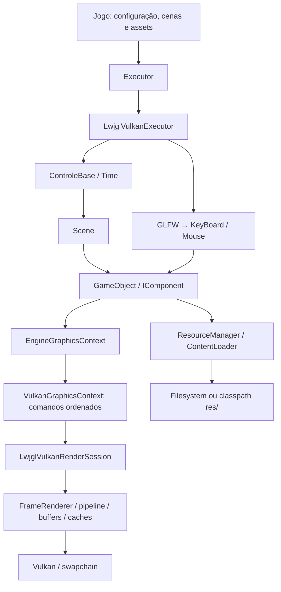

# BluePrint — EngineFX

Atualizado em 13/09/2026. Descreve o código implementado; trabalho futuro está em [PRD.md](PRD.md).

## Arquitetura e dependências

Engine 2D monolítica com composição de componentes. Java 25, Maven, LWJGL 3.4.3 (Vulkan/GLFW/STB/shaderc), Java Sound, LuaJava/Lua 5.4, Gson e Commons Lang. JUnit 5 cobre o núcleo e contratos nativos sem criar um dispositivo Vulkan.

Não há container de injeção, ECS de dados, barramento de eventos geral, servidor ou banco de dados. `ControleBase`, `Time`, teclado e mouse são serviços globais. Alguns componentes acessam diretamente o controlador: o contrato gráfico limita exposição de Vulkan ao jogo, mas as camadas não são totalmente independentes.

## Organização

| Pacote | Responsabilidade |
| --- | --- |
| `main` | Bootstrap, loop desktop e executáveis de smoke |
| `core` | Controlador, cenas, objetos, vetores, relógio e registro explícito de cenas |
| `graphics` | Contrato de desenho e dados próprios de cor, imagem e fonte |
| `platform.lwjgl` | Janela, instance/device, swapchain, shaders, pipeline, caches e buffers |
| `componentes` | Sprites, texto, mapas, áudio, scripts, câmera, física e debug |
| `resources` | Configuração, resolução de assets, cache e parser TMX |
| `scripting` | Contrato Lua público, limites, valores, capacidades e runtime interno |
| `input` | Estado do teclado e inscrições de mouse com dono |
| `fisica`, `geometry`, `interfaces` | Detecção AABB, primitivas e contratos de extensão |

Fontes de produção ficam em `src/br/com/engine`; testes, em `tests/br/com/engine`. O POM configura essa disposição explicitamente.

O subprojeto `lua-harness/` não é parte do artefato `enginefx` nem do ciclo de cenas. Ele é a prova técnica versionada da Etapa 1A: LuaJava/Lua 5.4 no JVM e no Native Image, com DLL e metadados JNI explícitos. Seu hook e wrappers de chamadas protegidas propagam o limite de instruções; o script de verificação executa casos positivos e negativos em pasta isolada. Desde a 2.2, o artefato principal usa LuaJava somente no pacote interno `scripting.internal`; o contrato público não carrega tipos da biblioteca. A 3.0 removeu Nashorn por completo.

## Inicialização e cenas

1. `Executor.loadGame` seleciona Vulkan e inicia `LwjglVulkanExecutor`.
2. O launcher configura FFM antes de inicializar LWJGL, instala callback de erro GLFW e carrega a configuração.
3. O controlador cria `Screen`; o launcher associa `VulkanGraphicsContext` e abre instance, janela, device e sessão de renderização.
4. `ControleBase.setup` cria loading, resolve primeiro factories do `SceneRegistry`, preserva temporariamente o adaptador reflexivo para cenas Java legadas e identifica `bootScene` explícita ou a cena `@Bootable`/primeira. Definições `type: "js"` são recusadas com `SCRIPT_TYPE_REMOVED`.
5. `nextScene(index)` agenda a troca. Na próxima iteração, a cena anterior é descartada, uma nova instância é criada, a câmera/transformação e o acumulador de física são reiniciados.
6. O encerramento fecha owners Vulkan, descarta a cena, limpa caches Java e termina GLFW.

Falhas de setup são propagadas e o estado parcialmente criado é descartado. A engine recria a instância ao revisitar uma cena; persistência entre visitas precisa de estado fora dela.

Em 2.1, a janela recebe `Configurations.getTitle()`, com fallback para configurações antigas. `requestExit()` marca a saída normal do loop; `stop()` é terminal e idempotente, inclusive após exceção de descarte. A 2.2 acrescenta `Configurations.bootScene`, `SceneRegistry` e `Executor.loadGame(args, registry)`. Factories do registro só são chamadas na visita à cena. A escolha de boot resolve aliases nos dois lados; o fallback legado consulta `@Bootable` sem instanciar nem inicializar classes. O loading pode ficar vazio quando o carregamento de sua fonte falha. Os testes de shutdown contam descartes; não cobrem toda falha parcial de inicialização nativa.

## Tempo, componentes e colisões

Cada iteração consulta eventos, executa lógica, coleta comandos e apresenta. `Time.update` limita o delta a 250 ms. Milissegundos legados preservam o resto de nanossegundos para não congelar temporizadores em FPS elevado.

Callbacks de teclado atualizam estado contínuo e conjuntos de bordas pendentes. `LwjglVulkanWindow.pollEvents()` consulta GLFW e então publica essas bordas por `beginFrame()`. `endFrame()` limpa apenas as bordas publicadas, preservando callbacks recebidos depois da lógica durante esperas do renderer para a próxima iteração.

Após `update`, o controlador acumula tempo para `fixedUpdate(1/60f)`, limitado a cinco passos por frame. Tempo excedente de física é descartado para evitar recuperação ilimitada. `Time.getInterpolationAlpha()` expõe a fração restante, mas os sprites ainda não interpolam posições.

`GameObject` possui componentes, filhos e posição aceita no último passo físico. `VectorMonitor` sincroniza câmera e propagação para filhos; componentes novos têm setup uma vez. Objetos/componentes adicionados durante callbacks entram ao concluir a iteração; remoção impede uso posterior e chama descarte.

A cena detecta contatos antes da resposta, percorrendo pares de objetos em ordem de inserção. Para cada par, `Colisao` retorna o primeiro par de colliders sobrepostos; a resposta retorna posições ao último estado aceito e invoca os colliders efetivamente envolvidos. É um mecanismo AABB discreto e simples, sem solver de impulsos, varredura contínua ou tratamento completo de todos os colliders de um mesmo par.

Descarte remove inscrições de mouse pertencentes à cena, ao objeto e aos componentes, inclui adições pendentes e continua a limpar os demais recursos se um callback falhar. Exceções adicionais são preservadas como suprimidas.

## Desenho e sincronização

`VulkanGraphicsContext` registra comandos de imagem, texto, retângulo e quad, incluindo cor e estado de transformação. O renderer converte a lista em vértices e agrupa apenas draws consecutivos que compartilham textura, preservando a ordem de transparência.

- Um frame em voo; fence aguardado antes de reescrever o buffer ou liberar texturas.
- Aquisição com semáforo próprio; `VkSubmitInfo` define explicitamente a contagem de espera.
- Semáforo de conclusão por imagem da swapchain.
- Reset do fence imediatamente antes do submit.
- OUT_OF_DATE/SUBOPTIMAL e mudança no framebuffer provocam recriação pela sessão.
- A sessão recria renderer, pipeline e caches junto com a swapchain.
- O buffer de vértices cresce por duplicação e preserva a alocação anterior se a nova falhar; limite explícito inferior a 2 GiB.
- Texturas ausentes do frame são descartadas após a espera. Upload de imagens ainda usa espera de fila; o pool de descritores tem capacidade fixa.
- Aposentadoria da swapchain usa `vkDeviceWaitIdle`; fences de apresentação via maintenance1 ainda não estão implementados.

O shader converte RGB sRGB para linear ao escrever em attachment sRGB; alpha permanece linear. O caminho UNORM mantém a composição legada. Esses contratos possuem testes estruturais, mas ainda faltam comparação de pixels e aceite visual.

## Recursos, texto e áudio

`ResourceManager` expõe APIs tipadas. `ContentLoader` resolve caminho exato em três raízes locais e depois em `/res/` do classpath. Imagens são compartilhadas por origem; fontes por origem/tamanho. Para conteúdo de pacotes, `ResourceRef` inclui id, hash e caminho; `ResourceResolver` só abre referências próprias. `DirectoryResourceResolver` compara caminhos reais para negar escapes por symlink/junction e `ClasspathResourceResolver` lê recursos empacotados sob uma raiz declarada. Os caches de imagem, fonte e TMX usam a referência qualificada, isolando packs com caminhos iguais.

STB decodifica RGBA para memória nativa, copia para `Image` imutável no heap e libera a alocação original imediatamente. O renderer recebe cópias RGBA para staging. `Font` mede os avanços com STB; o cache de rasterização usa os mesmos glifos e escala. O atlas é Latin-1 (32–255), com fallback `?` por code point e suporte a nova linha; Unicode completo, kerning e shaping não existem.

`AudioEffect` é dono do `AudioClip` e fecha a linha no descarte. Streams e linhas parcialmente abertas também são fechados em falhas. Java Sound permanece como API de áudio, embora a API gráfica não dependa de AWT.

Os antigos `PropertiesLoader`, `ScenesLoader` e `ConfigurationsManager` são fachadas depreciadas do resolvedor comum. A 3.0 não possui loader JavaScript: módulos Lua entram por `ScriptRuntime` e `ResourceResolver`.

## Scripting Lua 3.0

`ScriptRuntime` pertence à thread que o cria e cria um estado Lua 5.4 novo por `ScriptInstance`. Módulos são localizados por `ResourceRef`, com cache de fonte por `(packHash, path)` e lista explícita de dependências. A lista carrega/valida fontes, preserva dependências já declaradas e não importa nem executa módulos automaticamente; `require` permanece indisponível. Cada fonte é UTF-8, limitada a 1 MiB e deve retornar uma tabela; bytecode é recusado.

`ScriptValue` normaliza somente `null`, booleanos, inteiros, números finitos, strings, listas e mapas de chaves string. Profundidade, nós e tamanho de strings/chaves obedecem `ScriptLimits` durante a travessia, nas duas direções, inclusive para valores já normalizados. A conversão preserva listas vazias e nulos internos com marcadores Lua: `engine.value.list({})` e `engine.value.null`. Uma tabela vazia comum representa mapa; não há userdata nesse protocolo. A conversão recusa funções, userdata, tabelas cíclicas, chaves mistas e valores não finitos antes de passá-los ao jogo.

O ambiente Lua restringe as bibliotecas disponíveis. A busca de callbacks ocorre em chamada protegida e no mesmo orçamento do callback; reentrada e fechamento durante uma chamada ativa são rejeitados. Antes de esconder `debug`, instala o hook de instruções e wrappers de `pcall`/`xpcall`; assim, uma chamada protegida não converte o esgotamento de orçamento em sucesso. `java`, `io`, `os`, `debug`, `package`, `require`, loaders, coleta manual e objetos Java não ficam acessíveis. As APIs registradas retornam apenas `ScriptValue` e são verificadas por capacidade no `ScriptContext`.

A engine registra `engine.clock.now_millis`, `engine.state.get/set` e `engine.events.emit`; o jogo registra os próprios namespaces em `ScriptApiRegistry`. `LuaComponent` recebe `setup`, `update`, `fixed_update`, `on_event` e `dispose`, sempre com delta em segundos e sem referência ao `GameObject`. `LuaScene` transforma eventos apenas em `LuaSceneCommand` previamente permitido, para um sink Java que continua dono da composição de cena.

## TMX

O parser StAX aceita mapas finitos ortogonais, tilesets inline com imagem, layers base64 com zlib opcional, visibilidade e objetos retangulares/elípticos. Colunas podem vir do atributo ou da largura da imagem em mapas antigos. A ordem right/left e up/down orienta os draws.

Imagens são resolvidas relativamente ao arquivo TMX. O renderer valida os limites do tile na imagem e alinha tiles altos pela base da célula. Os objetos de colisão usam AABB completo, inclusive elipses.

TSX externo, flags de flip/rotação, grupos, image layers, offsets, opacidade parcial e formas não suportadas falham explicitamente. Não há promessa de compatibilidade geral com Tiled.

## Extensão e testes

Para adicionar comportamento, derive `SimpleComponent`, use setup para obter dependências e fixedUpdate para física, e libere inscrições/recursos em dispose. Para um novo comando gráfico, altere o contrato, o registro e o renderer, preservando ordem e regras de sincronização.

Testes locais cobrem lifecycle, tempo, input, recursos, scripts Lua, áudio inválido, métricas STB, TMX, crescimento de capacidade, seleção de present mode, shader e estrutura de submissão. Os testes Lua cobrem callbacks, valores, capacidades, limite protegido, thread, descarte, `LuaScene`, recursos iguais em packs diferentes, classpath e escape por junction. O harness do `dinofx` cobre o caminho GPU, empacotamento, troca de cenas, resize, crescimento nativo do buffer e o lifecycle de uma cena Lua oculta. Os resultados atuais estão no [revisão dos blocos 1B/1C](docs/reviews/2026-09-13-lua-blocks-review.md); [REVIEW.md](REVIEW.md) preserva a revisão histórica.

Atualize este arquivo quando mudar o fluxo de cenas, as regras de recursos, o contrato gráfico ou ownership de memória. Critérios ainda não demonstrados permanecem no PRD.
