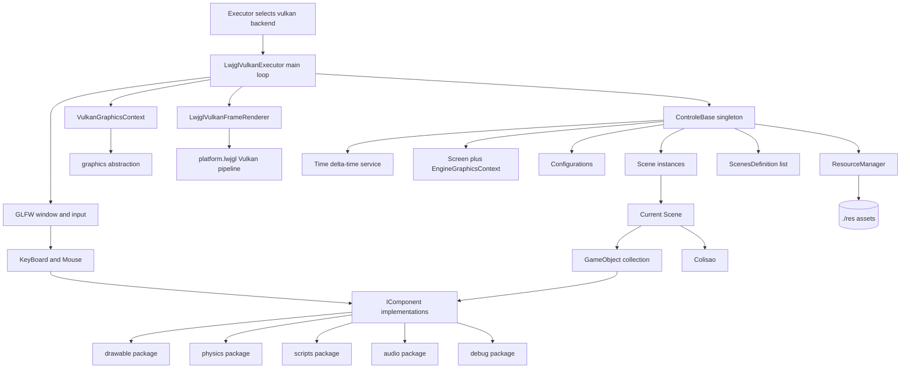
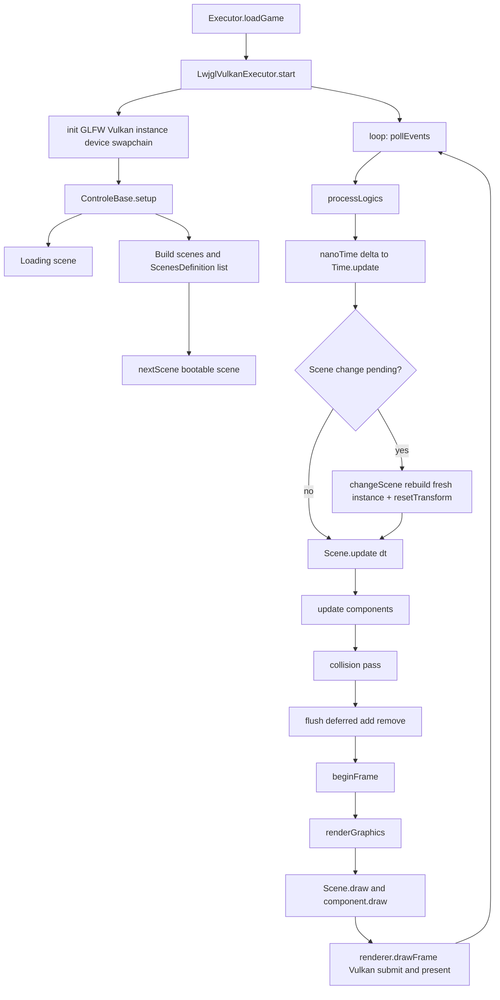
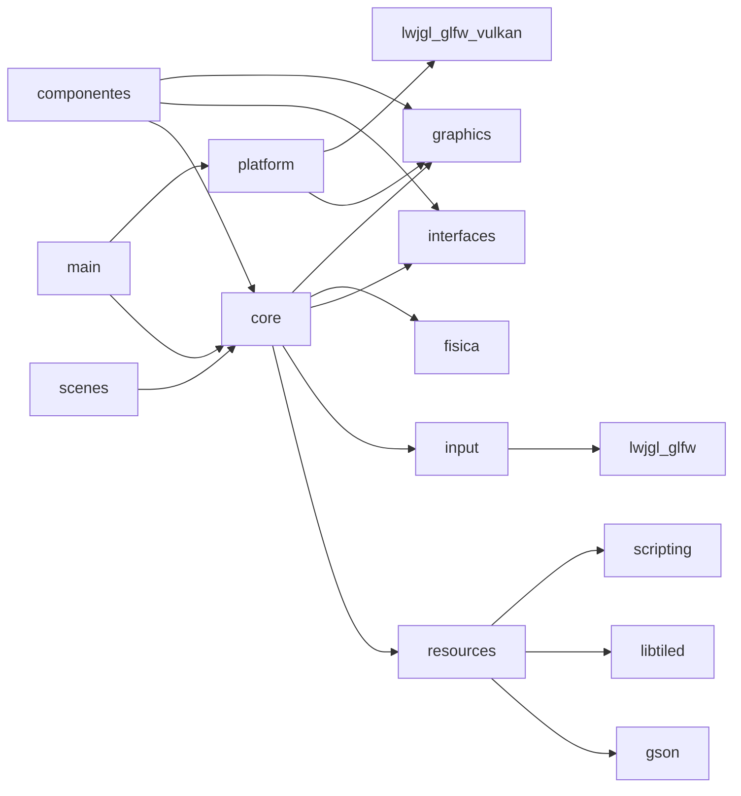
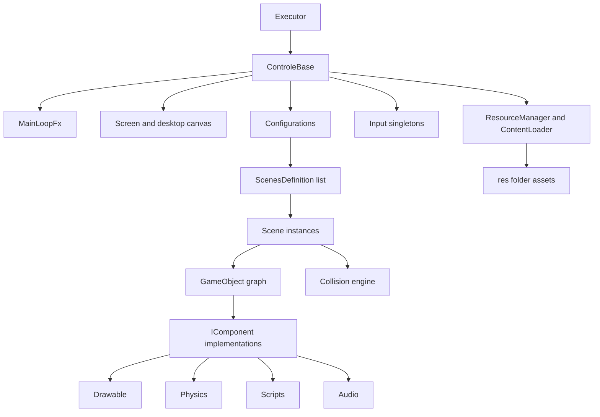
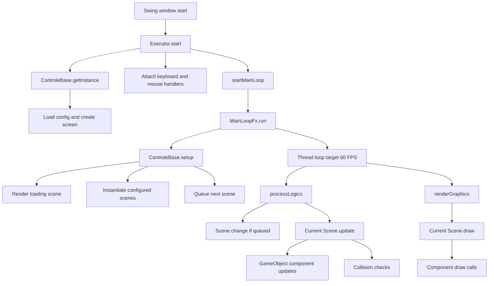
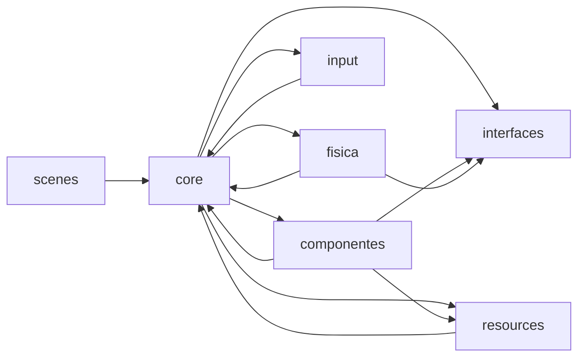

# Project Architecture Blueprint

Generated on June 2, 2026. Updated on June 3, 2026.

## 1. Architecture Detection And Analysis

This repository is a Java game engine built with Maven. The code targets Java 25 in [pom.xml](pom.xml). The desktop window and input come from **GLFW**, and rendering runs on a **LWJGL Vulkan** backend with a batched quad pipeline. It uses GSON for JSON parsing, LibTiled for TMX map loading, Apache Commons Lang for utility support, and Nashorn through `ScriptEngineManager` for JavaScript-based behavior.

The rendering and windowing subsystem lives under [src/br/com/engine/platform/lwjgl](src/br/com/engine/platform/lwjgl) behind the backend-neutral abstractions in [src/br/com/engine/graphics](src/br/com/engine/graphics). A legacy Swing/Java2D path still exists in the tree (for example [src/br/com/engine/graphics/Java2DGraphicsTransform.java](src/br/com/engine/graphics/Java2DGraphicsTransform.java) and `MainLoopFx`), but it is no longer the active runtime: `Executor` selects the Vulkan backend.

The dominant architectural style is a hybrid of:

- A monolithic desktop application.
- A layered engine structure organized by package responsibility.
- An entity-component style runtime model centered on `GameObject` plus `IComponent`.
- Convention-based resource loading driven by file paths and JSON manifests.
- A backend-neutral graphics abstraction (`graphics`) with a concrete Vulkan implementation (`platform.lwjgl`).

This is not a DI-container architecture, not a service-oriented system, and not a strict ECS in the data-oriented sense. Runtime behavior is controlled mainly by singletons, scene orchestration, component attachment, and per-frame iteration over in-memory objects.

## 2. Architectural Overview

At runtime, [src/br/com/engine/main/Executor.java](src/br/com/engine/main/Executor.java) sets `enginefx.backend=vulkan` and starts [src/br/com/engine/main/LwjglVulkanExecutor.java](src/br/com/engine/main/LwjglVulkanExecutor.java). That executor initializes GLFW, the Vulkan instance/device/swapchain, and a `VulkanGraphicsContext`, then runs the main loop directly (it no longer delegates to `MainLoopFx`). From there, [src/br/com/engine/core/ControleBase.java](src/br/com/engine/core/ControleBase.java) is the global engine coordinator. It loads configuration, owns the screen, builds scene instances, and is driven each frame by the executor through `processLogics`, `renderGraphics`, and the renderer's `drawFrame`.

The engine models world state through [src/br/com/engine/core/Scene.java](src/br/com/engine/core/Scene.java) and [src/br/com/engine/core/GameObject.java](src/br/com/engine/core/GameObject.java). A scene owns `GameObject` instances. A game object owns a list of components implementing [src/br/com/engine/interfaces/IComponent.java](src/br/com/engine/interfaces/IComponent.java). Those components are responsible for setup, per-frame logic, and drawing.

Frame timing is centralized in [src/br/com/engine/core/Time.java](src/br/com/engine/core/Time.java), a Unity-style service. `ControleBase.processLogics()` measures the elapsed time with `System.nanoTime()` each frame and calls `Time.update(...)` before scenes update, so gameplay can scale movement by `Time.getDeltaTime()` (seconds) and stay frame-rate independent. The frame loop is no longer capped at 60 FPS; pacing is left to the swapchain present mode.

The resulting architectural principles visible in code are:

- Global runtime coordination is centralized.
- Rendering is backend-neutral at the `graphics` boundary and Vulkan-specific under `platform.lwjgl`.
- Frame timing is centralized and exposed as a delta-time service for frame-rate independence.
- Scene transitions are deferred instead of immediate, and rebuild a fresh scene instance on switch.
- Game behavior is composed through components rather than deep inheritance.
- Resource loading is path- and extension-driven rather than registry-driven.
- Runtime mutation during iteration is controlled through explicit queues.

## 3. Architecture Visualization

### High-Level Component View



### Frame Flow



### Dependency Direction



## 4. Core Architectural Components

### Core Runtime

Files:

- [src/br/com/engine/core/ControleBase.java](src/br/com/engine/core/ControleBase.java)
- [src/br/com/engine/main/LwjglVulkanExecutor.java](src/br/com/engine/main/LwjglVulkanExecutor.java)
- [src/br/com/engine/core/Time.java](src/br/com/engine/core/Time.java)
- [src/br/com/engine/interfaces/LoopSteps.java](src/br/com/engine/interfaces/LoopSteps.java)
- [src/br/com/engine/core/Screen.java](src/br/com/engine/core/Screen.java)

Purpose and responsibility:

- Owns application-wide state.
- Loads configuration before the main loop starts.
- Hosts the active scene.
- Coordinates scene switching and rendering.
- Exposes the engine graphics context (`EngineGraphicsContext`, implemented by `VulkanGraphicsContext`).
- Centralizes frame timing through the `Time` service.

Internal structure:

- `ControleBase` is a lazily initialized singleton.
- `LwjglVulkanExecutor` owns the actual main loop: it polls GLFW events, calls `processLogics`, begins the frame, calls `renderGraphics`, and submits via the Vulkan renderer. The loop runs free (no `Thread.sleep` cap); pacing is delegated to the swapchain present mode.
- `Time` is a static, Unity-style delta-time service. `processLogics()` measures elapsed time with `System.nanoTime()` and calls `Time.update(...)` once per frame before scenes update. `Time.getDeltaTime()` returns seconds (clamped to `MAX_DELTA_SECONDS = 0.25` to avoid the "spiral of death"); the legacy `update(long time)` millis parameter is preserved via a nanosecond carry so sub-millisecond frames do not lose fractional time (important now that frames can be far shorter than 1 ms).
- `MainLoopFx` and `LoopSteps` describe the older thread-based cadence; `MainLoopFx` is no longer the active loop but `LoopSteps` still defines the lifecycle contract the executor drives.

Interaction patterns:

- `Executor` selects the Vulkan backend and starts `LwjglVulkanExecutor`.
- `LwjglVulkanExecutor` drives `ControleBase` (`setup`, `processLogics`, `renderGraphics`) and the Vulkan renderer each frame.
- Gameplay reads `Time.getDeltaTime()` to scale movement and stay frame-rate independent.

Evolution patterns:

- New runtime-wide behavior usually enters through `ControleBase`, `Time`, or `LoopSteps`.
- Changes here have broad consequences because almost every subsystem reaches back into the singleton.
- Frame-rate-dependent movement is a bug now that the loop is uncapped: scale by `Time.getDeltaTime()` (pixels per second), not fixed pixels per frame.

### Rendering And Platform Layer

Files:

- [src/br/com/engine/graphics/EngineGraphicsContext.java](src/br/com/engine/graphics/EngineGraphicsContext.java)
- [src/br/com/engine/platform/lwjgl/VulkanGraphicsContext.java](src/br/com/engine/platform/lwjgl/VulkanGraphicsContext.java)
- [src/br/com/engine/platform/lwjgl/LwjglVulkanFrameRenderer.java](src/br/com/engine/platform/lwjgl/LwjglVulkanFrameRenderer.java)
- [src/br/com/engine/platform/lwjgl/LwjglVulkanSwapchain.java](src/br/com/engine/platform/lwjgl/LwjglVulkanSwapchain.java)
- [src/br/com/engine/platform/lwjgl/LwjglVulkanQuadPipeline.java](src/br/com/engine/platform/lwjgl/LwjglVulkanQuadPipeline.java)
- [src/br/com/engine/platform/lwjgl/LwjglVulkanDynamicVertexBuffer.java](src/br/com/engine/platform/lwjgl/LwjglVulkanDynamicVertexBuffer.java)
- [src/br/com/engine/platform/lwjgl/LwjglVulkanWindow.java](src/br/com/engine/platform/lwjgl/LwjglVulkanWindow.java)

Purpose and responsibility:

- Provide a backend-neutral drawing API (`graphics`) consumed by components, and a concrete Vulkan implementation (`platform.lwjgl`).
- Manage the GLFW window, Vulkan instance/device/swapchain, command recording, and presentation.
- Batch 2D drawing into a dynamic vertex buffer of quads submitted per frame.

Internal structure:

- `EngineGraphicsContext` is the drawing contract (fill, draw image, text, transform translate, and `resetTransform()`).
- `VulkanGraphicsContext` is the only active implementation. It accumulates a translation offset (`translateX/translateY`); `resetTransform()` zeroes it. This reset is called on scene change so a previous scene's camera offset does not leak into the next scene.
- `LwjglVulkanFrameRenderer` owns the per-frame vertex buffer. Its capacity is sized for large scenes (tile grids can emit thousands of quads); the buffer is large enough that the last-drawn objects, such as the player, are not truncated. `LwjglVulkanDynamicVertexBuffer.upload(...)` guards against overflow by truncating a frame's excess instead of crashing.
- `LwjglVulkanSwapchain` prefers `VK_PRESENT_MODE_MAILBOX_KHR` when available, otherwise `VK_PRESENT_MODE_FIFO_KHR` (vsync). With the loop uncapped, present mode is what paces frames.

Interaction patterns:

- Components draw through the `EngineGraphicsContext` exposed by `ControleBase`/`Screen`.
- The camera component translates the context; `resetTransform()` clears accumulated translation between scenes.

Evolution patterns:

- Keep component drawing against the `graphics` abstraction, not directly against Vulkan types.
- A new backend would implement `EngineGraphicsContext` under a sibling of `platform.lwjgl` and be selected in `Executor`.

### Scene Layer

Files:

- [src/br/com/engine/core/Scene.java](src/br/com/engine/core/Scene.java)
- [src/br/com/engine/core/SceneJs.java](src/br/com/engine/core/SceneJs.java)
- [src/br/com/engine/resources/ScenesDefinition.java](src/br/com/engine/resources/ScenesDefinition.java)
- [src/br/com/engine/scenes/Loading.java](src/br/com/engine/scenes/Loading.java)
- [src/br/com/engine/core/annotation/Bootable.java](src/br/com/engine/core/annotation/Bootable.java)

Purpose and responsibility:

- Represents a playable or transitional world state.
- Owns and updates a collection of game objects.
- Handles deferred object add and remove.
- Performs collision checks as part of scene update.
- Always injects a default camera in `setup()`.

Internal structure:

- `Scene` contains the runtime collection plus waiting queues.
- `SceneJs` adapts JSON/script-driven object construction to the same `Scene` contract.
- `ControleBase` keeps two parallel lists: the live `Scene` instances and their `ScenesDefinition` factories.

Interaction patterns:

- `ControleBase` holds the current scene and swaps it through `nextScene()` and `changeScene()`.
- `changeScene()` rebuilds a fresh scene instance from `ScenesDefinition.getNewScene()`, replaces the slot in the scene list, resets the graphics transform via `resetTransform()`, and runs the new scene's `setup()`. This avoids stale per-scene field state when re-entering a scene (for example returning to the menu), which a singleton-reuse model previously caused.
- Scenes invoke `GameObject.setup()` when objects are added.
- Scenes call collision logic in `fisica.Colisao` during updates.
- `goToBootScene()` / `getBootScene()` support returning to the boot (menu) scene, used by gameplay scenes bound to ESC.

Evolution patterns:

- New Java scenes extend `Scene`.
- New boot scenes add the `@Bootable` annotation.
- Script-driven scenes flow through `SceneJs` and JSON/script manifests rather than new Java subclasses.
- Do not rely on scene fields persisting across visits; each entry runs `setup()` on a fresh instance.

### Entity And Component Model

Files:

- [src/br/com/engine/core/GameObject.java](src/br/com/engine/core/GameObject.java)
- [src/br/com/engine/interfaces/IComponent.java](src/br/com/engine/interfaces/IComponent.java)
- [src/br/com/engine/componentes/SimpleComponent.java](src/br/com/engine/componentes/SimpleComponent.java)
- [src/br/com/engine/componentes/VectorMonitor.java](src/br/com/engine/componentes/VectorMonitor.java)

Purpose and responsibility:

- `GameObject` is the engine entity container.
- Components hold behavior, rendering, physics, audio, or script logic.
- `SimpleComponent` gives components back-reference access to the parent object.
- `VectorMonitor` propagates movement deltas to child objects.

Internal structure:

- Each `GameObject` owns position, previous position, component list, child list, parent link, and destroy flag.
- `GameObject.setup()` always installs a `VectorMonitor` before executing component setup.
- Components follow `setup()`, `update(long time)`, and `draw()`.

Interaction patterns:

- Scenes iterate over components each frame.
- Collision-capable components are discovered through `CubeColisor` checks.
- Parent-child movement is implicit, driven by vector monitoring rather than explicit transform hierarchies.

Evolution patterns:

- Extend `SimpleComponent` when parent access is needed.
- Implement `IComponent` directly for stateless or utility behaviors.
- Avoid direct mutation of scene collections inside component logic; use scene APIs instead.

Sprite and animation note:

- [src/br/com/engine/componentes/drawable/Sprite.java](src/br/com/engine/componentes/drawable/Sprite.java) slices a sheet into a **uniform** `cx` by `cy` grid (equal-size cells). Sprite sheets must therefore be uniform; non-uniform frames drift and clip.
- [src/br/com/engine/componentes/scripts/Animator.java](src/br/com/engine/componentes/scripts/Animator.java) advances cell indices on a millisecond `interval` and calls `Sprite.setSprite(index)`. Because it accumulates the `update(long time)` millis, the timing relies on `ControleBase` delivering accurate per-frame millis (now derived from `nanoTime` with carry).

### Resource And Configuration Layer

Files:

- [src/br/com/engine/resources/ResourceManager.java](src/br/com/engine/resources/ResourceManager.java)
- [src/br/com/engine/resources/ContentLoader.java](src/br/com/engine/resources/ContentLoader.java)
- [src/br/com/engine/resources/Configurations.java](src/br/com/engine/resources/Configurations.java)
- [src/br/com/engine/resources/ScenesDefinition.java](src/br/com/engine/resources/ScenesDefinition.java)

Purpose and responsibility:

- Loads engine configuration and content assets.
- Encodes resource type constants and path conventions.
- Maps scene manifests into actual scene instances.
- Provides the scripting bridge for JavaScript behavior.

Internal structure:

- `ResourceManager` uses integer constants and explicit prefixes/suffixes such as `res/imagens/`, `res/config/`, `res/mapas/`, and `res/scripts/`.
- `ContentLoader` scans `./res` recursively and dispatches by file extension.
- `Configurations` is a simple POJO.
- `ScenesDefinition` creates scene instances reflectively and contains special handling for JS scenes.

Interaction patterns:

- `ControleBase` calls `ResourceManager` during initialization.
- Scripts receive an injected map of engine objects such as `gameObject`, `screen`, or `keyBoard`.

Evolution patterns:

- New asset types require loader extension in `ContentLoader` and possibly `ResourceManager`.
- New scenes must be represented in the scene manifest and follow current naming conventions.

### Input Layer

Files:

- [src/br/com/engine/input/KeyBoard.java](src/br/com/engine/input/KeyBoard.java)
- [src/br/com/engine/input/Mouse.java](src/br/com/engine/input/Mouse.java)
- [src/br/com/engine/input/KeyMap.java](src/br/com/engine/input/KeyMap.java)

Purpose and responsibility:

- Provide input state and callbacks sourced from GLFW keyboard and mouse events.
- Make input globally accessible to engine scripts and components.

Internal structure:

- Keyboard and mouse handlers are singletons.
- Input state is stored in memory and queried during update logic.
- Key identifiers are normalized through [src/br/com/engine/input/KeyCode.java](src/br/com/engine/input/KeyCode.java) and `KeyMap`.

Interaction patterns:

- The GLFW window registers input callbacks that feed the keyboard and mouse singletons.
- Scripts and components consume input through those singleton instances (for example `KeyBoard.infInstace().ifKeyPressed(KeyCode.X, ...)`).

Evolution patterns:

- New input behaviors should preserve the existing singleton event-handler model to avoid diverging runtime access patterns.
- External tools cannot synthesize GLFW key events, so input-dependent behavior is validated manually.

### Physics And Collision Layer

Files:

- [src/br/com/engine/fisica/Colisao.java](src/br/com/engine/fisica/Colisao.java)
- [src/br/com/engine/fisica/Resolver.java](src/br/com/engine/fisica/Resolver.java)
- [src/br/com/engine/interfaces/CubeColisor.java](src/br/com/engine/interfaces/CubeColisor.java)
- [src/br/com/engine/componentes/physics](src/br/com/engine/componentes/physics)

Purpose and responsibility:

- Determine collisions and call response hooks.
- Supply component-level collision shapes and movement behaviors.

Internal structure:

- Collision is performed during `Scene.update()`.
- Objects are reset to previous positions on collision before component callbacks run.

Interaction patterns:

- Components advertise collision capabilities through `CubeColisor`.
- `Scene` coordinates detection and invokes `onColision` on both colliding participants.

Evolution patterns:

- Additional collider types should be introduced carefully because collision orchestration currently assumes a narrow synchronous callback model.

## 5. Architectural Layers And Dependencies

The practical layers are:

1. Bootstrap layer: `main` (selects backend, owns the Vulkan main loop).
2. Runtime orchestration layer: `core` (includes the `Time` service).
3. Rendering and platform layer: `graphics` (backend-neutral) and `platform.lwjgl` (Vulkan/GLFW).
4. Domain behavior layer: `componentes`, `fisica`, `input`.
5. Support and content layer: `resources`.
6. Scenario implementations: `scenes`.
7. Contract layer: `interfaces`.

Dependency rules visible in code:

- `main` depends on `core` and the Vulkan/GLFW platform layer.
- `core` depends on `resources`, `input`, `interfaces`, physics utilities, and the `graphics` abstraction.
- Components depend on `core`, `interfaces`, and `graphics` (not directly on Vulkan types).
- `platform.lwjgl` implements `graphics` and depends on LWJGL/GLFW/Vulkan bindings.
- `resources` is largely utility-style and independent of scene orchestration, but returns types consumed by `core` and `componentes`.
- `scenes` depend on `core`, resources, and components.

Boundary enforcement is informal rather than automated. The codebase does not use module boundaries, package-private enforcement strategies, static architecture tests, or dependency injection scopes. Architectural consistency depends mostly on package conventions and the existing object model.

Known violations or soft spots:

- Global singleton access from many components couples behavior back to `ControleBase`.
- Scene update performs both orchestration and collision work, so domain boundaries are somewhat collapsed.
- Resource loading mixes discovery, parsing, and instantiation responsibilities.

## 6. Data Architecture

This engine does not expose a traditional persistence or repository architecture. Its main data model is in-memory runtime state.

Primary data structures:

- `Configurations`: engine startup settings such as screen size, debug mode, and scene definitions.
- `ScenesDefinition`: scene class metadata plus scene type.
- `GameObject`: the runtime entity aggregate.
- `Vector2`: position and movement representation.
- JSON scene and script descriptors used by `SceneJs`.
- Properties maps and JSON objects loaded as ad hoc configuration sources.

Aggregation model:

- A scene aggregates game objects.
- A game object aggregates components and child game objects.
- A component may reference its parent object if it extends `SimpleComponent`.

Data transformation patterns:

- JSON is deserialized directly into POJOs or `JsonObject` trees with GSON.
- Script data is injected as a plain `Map<String, Object>`.
- Resource loading dispatches by file extension rather than strong type registries.

Caching and validation:

- No durable caching layer is present.
- `ContentLoader` rescans the resource tree on demand.
- Input and configuration validation are minimal; many failure paths rely on exceptions or stack traces.

## 7. Cross-Cutting Concerns Implementation

### Authentication And Authorization

Not implemented. This is a local game engine runtime without identity boundaries or permission checks.

### Error Handling And Resilience

Current pattern:

- Most subsystems catch `Exception`, print stack traces, and either continue or return `null`.
- The active main loop in `LwjglVulkanExecutor` runs inside a try/finally that tears down the engine and terminates GLFW on exit; scene `setup` is wrapped so a failing scene prints its stack trace instead of killing the loop.
- The Vulkan vertex buffer guards against overflow by truncating an over-budget frame and logging, rather than throwing a `BufferOverflowException`.
- Resource loading often signals failure via `null` or unchecked exceptions.

Implications:

- Failure handling is simple but coarse.
- There is no retry, fallback, circuit breaker, or recovery strategy.
- Runtime failures in the main loop can terminate the application.

### Logging And Monitoring

Not implemented as a structured concern.

- The code uses `printStackTrace()` and occasional console output.
- Debug visibility is mostly graphical through injected debug components and an FPS counter.
- There is no logging abstraction, metrics pipeline, tracing, or event telemetry.

### Validation

Minimal and local.

- Resource names and paths are validated indirectly by file existence or format matching.
- Configuration binding relies on JSON structure matching POJO fields.
- Scene and script manifests can fail late at runtime.

### Configuration Management

Implemented through local resource files:

- JSON config in `res/config`.
- Scene manifests in `res/mapas`.
- Properties files under `./res`.

There is no environment layering, secret management, or feature-flag framework.

## 8. Service Communication Patterns

This codebase does not implement networked or multi-process service communication. Communication patterns are in-process and synchronous.

Observed communication styles:

- Java method invocation between engine layers.
- Swing/AWT event dispatch for input and window lifecycle.
- Script invocation through Nashorn `Invocable`.
- Reflection-based scene instantiation.

There is no API versioning, service discovery, serialization contract management beyond local JSON parsing, or asynchronous messaging bus.

## 9. Technology-Specific Architectural Patterns

### Java Patterns

- Swing `JFrame` plus `Canvas` provide the bootstrap window lifecycle.
- A custom thread loop is used as the main loop instead of `Timeline`.
- Reflection is used for scene instantiation from configuration.
- Interfaces are simple behavioral contracts rather than broad service abstractions.
- Components and scripts receive engine services through direct object references instead of DI.

### Desktop Runtime Patterns

- Rendering is canvas-based through an engine-owned graphics context backed by Java2D.
- Input handlers implement AWT `KeyListener` and `MouseListener`.
- A Swing `JFrame` owns the engine canvas and presents a `BufferedImage` through `BufferStrategy`.

### Scripting Patterns

- Nashorn scripts are loaded dynamically and can participate in per-frame updates.
- Scripts receive runtime objects through injected maps, which acts like a lightweight service context.
- `SceneJs` enables JSON-plus-script-driven content assembly on top of the same scene lifecycle.

## 10. Implementation Patterns

### Interface Design Patterns

- `IComponent` is intentionally small and lifecycle-oriented.
- `LoopSteps` models the engine loop as explicit lifecycle phases.
- `CubeColisor` adds collision-specific responsibilities without forcing them on all components.

### Runtime Service Patterns

- `ControleBase` acts as the runtime service locator.
- `KeyBoard` and `Mouse` use singleton access for globally shared state.
- Resources are loaded via utility classes instead of injected services.

### Object Composition Patterns

- `GameObject.addComponente()` attaches behavior at runtime.
- `SimpleComponent` provides parent access without forcing every component to carry engine context manually.
- `VectorMonitor` acts as an implicit observer for transform propagation.

### Scene Construction Patterns

- Java scenes subclass `Scene` directly.
- Scripted scenes build objects from JSON and attach script components or sprites dynamically.
- Scene registration is externalized into the scene manifest instead of hard-coded in the engine bootstrap.

### Resource Patterns

- `ResourceManager` is prefix/suffix oriented and strongly tied to established folder names.
- `ContentLoader` is extension-driven and format-dispatch based.
- The resource layer favors convenience over strict type safety.

## 11. Testing Architecture

There is no test framework configured in [pom.xml](pom.xml), and the repository does not contain test sources under a standard Maven test layout.

Practical impact:

- Architecture correctness is verified mostly by compilation and runtime behavior.
- Regressions in scene changes, script wiring, or resource conventions are likely to surface only at runtime.
- There are no architecture tests, unit tests, or integration harnesses protecting package boundaries.

Recommended test boundary model for future growth:

1. Unit tests for pure math and collision helpers.
2. Narrow scene-construction tests for resource manifest parsing.
3. Smoke tests for boot scene loading and loop startup.

## 12. Deployment Architecture

The current deployment model is local desktop execution.

Detected characteristics:

- Maven compiles the Java sources.
- There is no wrapper script in the repo.
- Runtime asset resolution assumes `./res/...` exists relative to the working directory.
- There is no containerization, cloud deployment, remote configuration, or CI/CD description in the repo.

Operational implication:

- Packaging and launch processes must preserve the expected resource directory layout.
- Build portability depends on Maven and a desktop JDK environment with AWT/Swing available.

## 13. Extension And Evolution Patterns

### Feature Addition Patterns

- New engine-wide loop behavior belongs in `core` and should be added conservatively because it affects every frame.
- New entity behaviors should generally be new components under `componentes`.
- New scenes should extend `Scene` or use the JS scene pathway when data-driven construction is desired.
- New assets should conform to the naming and location conventions already encoded in the resource layer.

### Modification Patterns

- Prefer changes at the owning abstraction instead of layering new global conditionals in `ControleBase`.
- Preserve deferred scene mutation rules in `Scene`; avoid modifying object collections while iterating.
- Keep `GameObject.setup()` semantics in mind because it injects `VectorMonitor` automatically.
- Be careful with debug behavior because scenes inject extra debug components when debug mode is enabled.

### Integration Patterns

- New script integrations should follow the current `Map<String, Object>` injection model unless the runtime is being modernized deliberately.
- New resource types should extend `ContentLoader` and `ResourceManager` together so path conventions and discovery stay aligned.
- If external systems are added later, isolate them behind new packages rather than pushing more responsibilities into `core`.

## 14. Architectural Pattern Examples

### Layer Separation Example

`Executor` only bootstraps the desktop window and delegates engine control:

```java
public class Executor {
    public void start() {
        JFrame frame = new JFrame("Enginefx");
        frame.add(ControleBase.getInstance().getScreen().getCanvas());
        frame.setVisible(true);
        ControleBase.getInstance().startMainLoop();
    }
}
```

This keeps startup concerns in `main` while the runtime loop remains in `core`.

### Component Composition Example

`GameObject` composes behavior dynamically:

```java
public void addComponente(IComponent componente) {
    if (componente instanceof SimpleComponent) {
        ((SimpleComponent) componente).setParent(this);
    }
    this.componentes.add(componente);
}
```

This pattern makes components reusable while still allowing parent-aware behaviors.

### Deferred Mutation Example

`Scene` defers collection mutations during update:

```java
public void add(GameObject obj) {
    if (lockList) {
        lGameObjectsWaitAdd.add(obj);
    } else {
        this.lGameObjects.add(obj);
        obj.setup();
    }
}
```

This prevents update-phase structural changes from corrupting frame iteration.

### Script Extension Example

Scripts are injected with runtime objects before execution:

```java
Map<String, Object> map = new HashMap<>();
map.put("gameObject", getParent());
map.put("screen", ControleBase.getInstance().getScreen());
map.put("keyBoard", KeyBoard.infInstace());
invoc = ResourceManager.loadResource(jsName, ResourceManager.SCRIPT, Invocable.class, map);
```

This is the engine's primary lightweight extension mechanism for behavior outside compiled Java classes.

## 15. Architectural Decision Records

### ADR 1: Use A Singleton Runtime Controller

Context:

- The engine needs one active screen, one current scene, and one frame loop owner.

Decision:

- Centralize runtime control in `ControleBase` as a singleton.

Consequences:

- Simplifies access to screen and engine state.
- Increases coupling and makes isolation harder.
- Encourages service-locator style access from components.

### ADR 2: Use Component Composition Instead Of Deep Inheritance

Context:

- Game objects need combinations of rendering, input, physics, audio, and scripted behavior.

Decision:

- Compose behavior through `IComponent` implementations attached to `GameObject`.

Consequences:

- Improves flexibility for feature assembly.
- Leaves some cross-component coordination implicit.
- Requires discipline to keep components cohesive.

### ADR 3: Defer Scene And Object Mutation During Update

Context:

- The engine iterates directly over in-memory collections each frame.

Decision:

- Queue add and remove operations when scene lists are locked.

Consequences:

- Prevents concurrent modification errors.
- Makes timing of object availability one frame-sensitive concern.
- Requires contributors to respect `Scene.add()` and `Scene.remove()`.

### ADR 4: Use Convention-Based Resource Loading

Context:

- The engine needs simple asset access without a heavy registry layer.

Decision:

- Encode fixed path prefixes, suffixes, and extension-based dispatch in the resource layer.

Consequences:

- Keeps the content pipeline lightweight.
- Couples runtime correctness to folder layout and file names.
- Makes some failures appear only at runtime.

### ADR 5: Support Scriptable Behavior Through Nashorn

Context:

- The engine supports rapid behavior definition outside compiled Java classes.

Decision:

- Load and invoke JavaScript through Nashorn and `Invocable`.

Consequences:

- Enables lightweight content-driven behavior.
- Ties the engine to an older Java scripting model.
- Adds runtime dynamism but reduces compile-time safety.

## 16. Architecture Governance

Architectural consistency is maintained informally.

Current governance mechanisms:

- Package organization communicates intended ownership.
- Base abstractions such as `Scene`, `GameObject`, `IComponent`, and `SimpleComponent` shape extension patterns.
- The new [AGENTS.md](AGENTS.md) documents practical conventions for contributors and coding agents.

Missing governance mechanisms:

- No static dependency rules.
- No linting or architecture verification step.
- No automated tests enforcing invariants.
- No ADR repository outside what is inferred from code.

Recommended low-cost governance improvements:

1. Keep architectural docs updated when `core`, `resources`, or scene-loading behavior changes.
2. Add at least compile and smoke-test validation to CI when available.
3. Protect resource conventions and scene manifests with a few narrow tests.

## 17. Blueprint For New Development

### Development Workflow

For a new component:

1. Choose the correct package under `componentes`.
2. Implement `IComponent` or extend `SimpleComponent`.
3. Add the component to a `GameObject` in a scene or builder.
4. Validate the behavior in the frame loop.

For a new scene:

1. Extend `Scene`.
2. Call `super.setup()` unless you intentionally replace the default camera behavior.
3. Add and configure game objects through `add()`.
4. Register the scene in the manifest used by configuration.
5. Mark it `@Bootable` if it should be the startup scene.

For a new asset-backed feature:

1. Place the file under the expected `res` subtree.
2. Reuse an existing loader path if the type already exists.
3. Extend the content loader only if the asset type is genuinely new.

### Implementation Templates

Component template:

```java
public class ExampleComponent extends SimpleComponent {
    @Override
    public void setup() {
    }

    @Override
    public void update(long time) {
    }

    @Override
    public void draw() {
    }
}
```

Scene template:

```java
@Bootable
public class ExampleScene extends Scene {
    @Override
    public void setup() {
        super.setup();
        GameObject object = new GameObject("example");
        object.addComponente(new ExampleComponent());
        add(object);
    }
}
```

### Common Pitfalls

- Do not mutate scene object lists directly while `Scene.update()` is iterating.
- Do not assume scene switching is immediate after calling `nextScene()`.
- Do not forget that `GameObject.setup()` injects a `VectorMonitor`.
- Do not hardcode new resource paths that bypass `ResourceManager` conventions without a deliberate design change.
- Do not treat scripts as compile-time safe integrations.
- Do not rely on absent test coverage to catch lifecycle regressions.

### Maintenance Guidance

- Update this document when the loop contract, scene-loading mechanism, scripting model, or resource conventions change.
- Prefer adding examples for new extension patterns rather than duplicating package-level descriptions.
- Revisit the scripting section if the runtime moves away from Nashorn or if Java target levels change.# Project Architecture Blueprint

Generated: 2026-06-02

This document describes the architecture implemented in this repository as it exists today. It is intended to be the reference point for maintaining architectural consistency and for adding new engine features without working against the current design.

## 1. Architecture Detection And Analysis

### Technology stack

- Language: Java
- Build system: Maven via [pom.xml](pom.xml)
- UI and rendering runtime: Swing plus Java2D temporary desktop backend
- Rendering model: `Canvas` plus `BufferedImage` plus engine-owned `EngineGraphicsContext`
- Serialization: Gson
- Map format support: libtiled TMX reader
- Scripting: Nashorn via `javax.script`
- Utility library: Apache Commons Lang

### Detected architectural pattern

The engine is primarily a monolithic, layered game runtime with an entity-component style object model.

- Monolithic: all engine concerns live in a single deployable desktop application.
- Layered: startup, runtime control, scene management, components, input, physics, and resources are separated by package responsibility.
- Entity-component: [src/br/com/engine/core/GameObject.java](src/br/com/engine/core/GameObject.java) composes behavior from `IComponent` implementations rather than from deep inheritance trees.
- Convention-based resource architecture: resource loading is driven by folder layout and filename conventions in [src/br/com/engine/resources/ResourceManager.java](src/br/com/engine/resources/ResourceManager.java) and [src/br/com/engine/resources/ContentLoader.java](src/br/com/engine/resources/ContentLoader.java).

### Guiding principles evident in the code

- Keep the runtime loop centralized in one controller.
- Represent game behavior as attachable components.
- Load scenes and resources dynamically from configuration and resource manifests.
- Keep rendering and update orchestration inside the engine core, while allowing scene-specific behavior through scene subclasses and script components.

## 2. Architectural Overview

The application starts in Swing, initializes a singleton runtime controller, loads configuration and scenes, then enters a fixed-rate thread loop. Each frame processes logic, checks collisions, and renders the current scene into a Java2D-backed framebuffer that is presented through the engine canvas.

The architecture centers on these boundaries:

- Application bootstrap: [src/br/com/engine/main/Executor.java](src/br/com/engine/main/Executor.java)
- Runtime control and scene switching: [src/br/com/engine/core/ControleBase.java](src/br/com/engine/core/ControleBase.java)
- Fixed-rate loop: [src/br/com/engine/core/MainLoopFx.java](src/br/com/engine/core/MainLoopFx.java)
- Scene lifecycle and object graph: [src/br/com/engine/core/Scene.java](src/br/com/engine/core/Scene.java)
- Entity composition: [src/br/com/engine/core/GameObject.java](src/br/com/engine/core/GameObject.java)
- Resource and configuration loading: [src/br/com/engine/resources/ResourceManager.java](src/br/com/engine/resources/ResourceManager.java)

This is not a clean architecture or DI-container-based system. Most dependencies flow through direct construction, static access, and the `ControleBase` singleton.

## 3. Architecture Visualization

### High-level subsystem view



### Runtime control-flow view



### Package/component relationship view



## 4. Core Architectural Components

### Core runtime

#### Purpose and responsibility

The `core` package owns application control, the game loop, screen management, scenes, game objects, and vectors.

#### Internal structure

- [src/br/com/engine/core/ControleBase.java](src/br/com/engine/core/ControleBase.java): singleton engine controller implementing `LoopSteps`
- [src/br/com/engine/core/MainLoopFx.java](src/br/com/engine/core/MainLoopFx.java): thread-based fixed-step loop wrapper
- [src/br/com/engine/core/Scene.java](src/br/com/engine/core/Scene.java): abstract scene base with deferred collection mutation
- [src/br/com/engine/core/GameObject.java](src/br/com/engine/core/GameObject.java): component container with parent-child propagation
- [src/br/com/engine/core/Screen.java](src/br/com/engine/core/Screen.java): canvas plus framebuffer wrapper for the rendering target
- [src/br/com/engine/core/Vector2.java](src/br/com/engine/core/Vector2.java): mutable position/value object

#### Interaction patterns

- `Executor` hands control to `ControleBase`.
- `ControleBase` delegates frame ticks to `Scene` instances.
- `Scene` delegates behavior to each `GameObject`'s components.
- `GameObject` assigns itself as parent to `SimpleComponent` implementations.

#### Evolution patterns

- Add new scenes by subclassing `Scene`.
- Add new game behavior by implementing `IComponent` or extending `SimpleComponent`.
- Avoid replacing `ControleBase` unless the task is architectural refactoring; most extensions should happen underneath it.

### Component system

#### Purpose and responsibility

The `componentes` package is the behavioral extension layer. It contains reusable features that can be attached to `GameObject` instances.

#### Internal structure

- Base abstractions: [src/br/com/engine/componentes/SimpleComponent.java](src/br/com/engine/componentes/SimpleComponent.java), [src/br/com/engine/interfaces/IComponent.java](src/br/com/engine/interfaces/IComponent.java)
- Rendering components: `drawable/*`
- Physics helpers and colliders: `physics/*`
- Runtime scripts: `scripts/*`
- Debug visualization: `debug/*`
- Builders: `builders/*`
- Audio playback: `audio/*`

#### Interaction patterns

- Every component participates in `setup`, `update`, and `draw`.
- `Scene` updates most components, then explicitly updates `VectorMonitor` so parent motion is applied after earlier component logic.
- Some components pull engine dependencies directly from `ControleBase` or `ResourceManager`.

#### Evolution patterns

- Prefer component addition over scene subclass bloat.
- Prefer `SimpleComponent` for features that need parent access.
- If a new component should be discoverable by type, review [src/br/com/engine/componentes/TypeComponents.java](src/br/com/engine/componentes/TypeComponents.java).

### Resource and configuration layer

#### Purpose and responsibility

The `resources` package maps file conventions into runtime objects, loads configuration, and instantiates scenes.

#### Internal structure

- [src/br/com/engine/resources/Configurations.java](src/br/com/engine/resources/Configurations.java): screen size, debug mode, and scene list model
- [src/br/com/engine/resources/ScenesDefinition.java](src/br/com/engine/resources/ScenesDefinition.java): reflection-based scene creation
- [src/br/com/engine/resources/ResourceManager.java](src/br/com/engine/resources/ResourceManager.java): type-constant loader using known prefixes and suffixes
- [src/br/com/engine/resources/ContentLoader.java](src/br/com/engine/resources/ContentLoader.java): recursive resource discovery under `./res`

#### Interaction patterns

- `ControleBase` loads `Configurations` during singleton initialization.
- Scene definitions are read from configuration and instantiated dynamically.
- Script components receive data maps injected into Nashorn.

#### Evolution patterns

- New asset types require updates in the loading layer.
- New scene loading modes currently require modifying `ScenesDefinition` or `SceneJs`.

### Input layer

#### Purpose and responsibility

The `input` package provides singleton handlers for keyboard and mouse input using AWT listeners.

#### Internal structure

- [src/br/com/engine/input/KeyBoard.java](src/br/com/engine/input/KeyBoard.java)
- [src/br/com/engine/input/Mouse.java](src/br/com/engine/input/Mouse.java)
- [src/br/com/engine/input/KeyMap.java](src/br/com/engine/input/KeyMap.java)

#### Interaction patterns

- `Executor` registers handlers with the engine canvas hosted inside the Swing frame.
- Components and scripts query the input singletons at runtime.

#### Evolution patterns

- New input behaviors should remain behind the input package rather than being reimplemented in individual scenes.

### Physics and collision layer

#### Purpose and responsibility

The `fisica` package and collider-related components implement collision checks and collision callbacks.

#### Internal structure

- [src/br/com/engine/fisica/Colisao.java](src/br/com/engine/fisica/Colisao.java)
- [src/br/com/engine/interfaces/CubeColisor.java](src/br/com/engine/interfaces/CubeColisor.java)
- physics components in `componentes/physics`

#### Interaction patterns

- `Scene.update(...)` detects collisions during the frame update.
- On collision, positions revert to previous positions and both colliders receive callbacks.

#### Evolution patterns

- Collision policy is embedded in `Scene.update(...)`; extending physics often means touching both the collider component and the scene loop.

## 5. Architectural Layers And Dependencies

### Layer map

1. Bootstrap layer: `main`
2. Runtime orchestration layer: `core`
3. Extension contracts: `interfaces`
4. Behavior layer: `componentes`
5. Platform services: `input`, `resources`, `fisica`
6. Content layer: `scenes` and runtime `res` assets

### Dependency rules implemented in practice

- `main` depends on `core`.
- `core` depends on `interfaces`, `resources`, `input`, and `componentes`.
- `componentes` depends on `core`, `interfaces`, and `resources`.
- `scenes` depends on `core` and components.
- `resources` instantiates `core.Scene` implementations via reflection.

### Boundary enforcement

Boundary enforcement is conventional rather than formal.

- There is no DI container.
- There are no architecture tests.
- There are no module boundaries beyond Java packages.

### Observed coupling and violations

- `ControleBase` is a global singleton and acts as a shared dependency hub.
- `Scene.update(...)` owns update ordering, collision handling, and destruction removal, which mixes multiple concerns into one method.
- `ScenesDefinition` directly references [src/br/com/engine/core/SceneJs.java](src/br/com/engine/core/SceneJs.java), so scene creation is not open-ended.

## 6. Data Architecture

### Domain model structure

The core runtime model is in-memory and object-oriented.

- `Scene` contains a list of `GameObject` instances.
- `GameObject` contains a list of `IComponent` instances and optional child objects.
- `Vector2` represents mutable positional state.
- `Configurations` and `ScenesDefinition` are lightweight configuration models.

### Entity relationships

- One scene to many game objects.
- One game object to many components.
- One parent game object to many child game objects.
- Optional collider-to-collider interactions per frame.

### Data access patterns

- No repository abstraction is present.
- No persistent domain storage is present.
- Resource access is file-system based.
- JSON is deserialized directly into objects or JSON trees.

### Data transformation patterns

- Gson maps configuration JSON to POJOs or `JsonObject` trees.
- Script data is injected through `Map<String, Object>` values.
- TMX maps are read into libtiled objects.

### Caching and validation

- There is no central cache layer.
- `ContentLoader` scans `./res` recursively at load time.
- Validation is minimal and mostly relies on runtime exceptions or null returns.

## 7. Cross-Cutting Concerns Implementation

### Authentication and authorization

Not implemented. This is a local game engine runtime with no user identity model.

### Error handling and resilience

- The dominant strategy is `try/catch` with `printStackTrace()`.
- The main loop treats unexpected exceptions as fatal and exits the process.
- Resource loading often returns `null` on failure after logging stack traces.
- There are no retries, fallbacks, circuit breakers, or structured error types.

### Logging and monitoring

- No logging framework is configured.
- Debug visibility is implemented mainly through debug draw components and a frame counter.
- There is no telemetry, metrics, tracing, or centralized diagnostics pipeline.

### Validation

- Input validation is sparse.
- Configuration and resource assumptions are enforced at runtime rather than up front.
- Several APIs can return `null` or throw generic runtime exceptions when resources are missing.

### Configuration management

- Primary configuration source: JSON and resource-manifest files under `res`.
- Environment-specific configuration is not modeled.
- Secret management and feature flags are not present.

## 8. Service Communication Patterns

This engine does not expose service boundaries in the usual application sense.

- Communication is in-process only.
- Coordination is synchronous and method-call based.
- The main async exception is scene setup being offloaded into a plain Java `Runnable` executed by a scheduled executor during scene changes.
- No network APIs, RPC, service discovery, or versioned external interfaces are present.

## 9. Java-Specific Architectural Patterns

### Bootstrap process

- Swing startup is implemented in [src/br/com/engine/main/Executor.java](src/br/com/engine/main/Executor.java).
- Runtime initialization is lazy through `ControleBase.getInstance()`.

### Dependency management

- Dependencies are managed through Maven in [pom.xml](pom.xml).
- There is no Spring, CDI, Guice, or equivalent dependency injection framework.

### Reflection and dynamic behavior

- Scene instantiation uses `Class.forName(...).newInstance()` in [src/br/com/engine/resources/ScenesDefinition.java](src/br/com/engine/resources/ScenesDefinition.java).
- Script loading uses Nashorn and `Invocable` in [src/br/com/engine/componentes/scripts/ScriptJsComponent.java](src/br/com/engine/componentes/scripts/ScriptJsComponent.java).

### AOP, transactions, ORM, and services

Not present. This is not a server-side enterprise Java architecture.

## 10. Implementation Patterns

### Interface design patterns

- `IComponent` is intentionally minimal and lifecycle-oriented.
- `LoopSteps` defines loop phases for the runtime controller.
- Collider behavior is separated into the `CubeColisor` interface.

### Runtime service implementation patterns

- Runtime services are mostly singleton or static-access based.
- Engine-wide shared state sits in `ControleBase`, `KeyBoard`, and `Mouse`.

### Object composition patterns

- `GameObject` composition is the main extensibility mechanism.
- `SimpleComponent` provides a small convenience base class for component authors.
- Builders are used selectively for scripts and font-related construction.

### Domain model implementation pattern

- Mutable in-memory objects are favored over immutable domain types.
- Position history is tracked through current and previous vectors to support collision rollback.

## 11. Testing Architecture

- No `src/test` tree is present.
- No unit-test framework is configured in [pom.xml](pom.xml).
- No architecture tests or integration tests are present.

### Practical implication

Testing currently depends on manual runtime verification. If automated tests are added, the most valuable first targets are:

- `Scene` deferred add/remove behavior
- collision rollback behavior
- `ContentLoader` file resolution and ambiguity handling
- `ScenesDefinition` scene instantiation behavior

## 12. Deployment Architecture

- Deployment target is a desktop Swing/Java2D application.
- Packaging is Maven-based, but no dedicated launcher plugin or distribution packaging is configured.
- The runtime expects the `res` directory layout to exist relative to the working directory.
- No containers, cloud runtime, orchestrators, or environment promotion flows are defined.

### Runtime dependencies

- JDK with desktop AWT/Swing support available
- filesystem access to `./res`
- Maven for build-time compilation and packaging

## 13. Extension And Evolution Patterns

### Feature addition patterns

#### Add a new scene

1. Create a class extending `Scene` under `scenes` or another appropriate package.
2. Override `setup()` and call `super.setup()` if the default camera should remain.
3. Register the scene in the configured scene list.
4. Optionally annotate it with `@Bootable`.

#### Add a new component

1. Implement `IComponent` or extend `SimpleComponent`.
2. Keep setup, update, and draw responsibilities local to the component.
3. Attach it to a `GameObject` in a scene or builder.
4. If type-based lookup matters, review `TypeComponents` support.

#### Add a new script-driven behavior

1. Provide a JavaScript file under the expected script folder.
2. Use `ScriptJsComponent` or `SceneJs` loading flows.
3. Ensure the script exports the expected `update` function.

#### Add a new resource type

1. Extend `ContentLoader` and possibly `ResourceManager` with a new dispatch branch.
2. Document the filename convention and runtime expectations.

### Modification patterns

- Prefer local changes inside the owning package.
- Treat `ControleBase`, `Scene`, and `GameObject` as high-blast-radius classes.
- Preserve deferred mutation inside `Scene` to avoid collection mutation during iteration.
- Preserve `VectorMonitor` ordering unless deliberately changing movement propagation semantics.

### Integration patterns

- New external systems would currently need adapter-style wrappers inside `resources` or a new package.
- Keep external library-specific objects from leaking broadly through unrelated packages unless they are true runtime primitives.

## 14. Architectural Pattern Examples

### Component lifecycle pattern

Representative sources:

- [src/br/com/engine/interfaces/IComponent.java](src/br/com/engine/interfaces/IComponent.java)
- [src/br/com/engine/componentes/SimpleComponent.java](src/br/com/engine/componentes/SimpleComponent.java)
- [src/br/com/engine/core/Scene.java](src/br/com/engine/core/Scene.java)

Pattern summary:

- The scene owns the frame-level iteration.
- Each game object delegates work to its components.
- Components remain small and focused on one behavior.

### Reflection-based scene factory pattern

Representative source:

- [src/br/com/engine/resources/ScenesDefinition.java](src/br/com/engine/resources/ScenesDefinition.java)

Pattern summary:

- Scene identifiers come from configuration.
- The engine chooses Java or JS instantiation behavior.
- The engine can add scenes without changing bootstrap code, but not without changing manifests.

### Script integration pattern

Representative sources:

- [src/br/com/engine/componentes/scripts/ScriptJsComponent.java](src/br/com/engine/componentes/scripts/ScriptJsComponent.java)
- [src/br/com/engine/core/SceneJs.java](src/br/com/engine/core/SceneJs.java)

Pattern summary:

- Java objects are injected into Nashorn through a map.
- Scripts participate in the update loop through `Invocable`.
- This provides lightweight behavior extension without adding new Java classes for every change.

## 15. Architectural Decision Records

These decisions are inferred from the current implementation.

### Decision 1: Use a singleton runtime controller

- Context: the engine needs one screen, one current scene, and one main loop coordinator.
- Decision: centralize that state in `ControleBase`.
- Positive consequence: simple access from anywhere in the runtime.
- Negative consequence: high coupling, global state, and harder test isolation.

### Decision 2: Use component composition for game behavior

- Context: scenes need flexible combinations of sprite, script, collision, and debug behavior.
- Decision: store behaviors as components on `GameObject`.
- Positive consequence: flexible reuse and fewer inheritance hierarchies.
- Negative consequence: update ordering and cross-component coordination become implicit.

### Decision 3: Use configuration and reflection for scene loading

- Context: scene selection should be data-driven.
- Decision: deserialize scene definitions and instantiate by class name or JS mode.
- Positive consequence: bootstrap remains stable while scenes change.
- Negative consequence: errors are discovered at runtime and type safety is reduced.

### Decision 4: Use direct filesystem-based resource loading

- Context: the engine needs a simple content pipeline for local assets.
- Decision: load assets from `./res` using naming conventions and extension dispatch.
- Positive consequence: easy authoring model for small projects.
- Negative consequence: weak validation, runtime ambiguity, and repeated directory scanning.

## 16. Architecture Governance

Architectural consistency is currently maintained by convention and by the small size of the codebase rather than by formal governance tooling.

- No static architecture rules are configured.
- No lint or code style tooling is configured in Maven.
- No automated tests enforce boundaries.
- The main governance mechanism is package structure and developer discipline.

### Recommended lightweight governance additions

- Add automated tests for core runtime behavior.
- Add a small contributor note describing scene/component/resource conventions.
- Add build validation for unsupported Java versions and missing runtime resources.

## 17. Blueprint For New Development

### Development workflow

#### When adding a new gameplay behavior

1. Start at the owning scene.
2. Decide whether the behavior belongs in a new component, a script, or an existing component.
3. Attach the behavior to a `GameObject`.
4. Validate update order, collision interaction, and draw behavior.

#### When adding a new resource-backed feature

1. Decide whether the current resource conventions already support it.
2. If not, extend `ContentLoader` and `ResourceManager` together.
3. Keep the public loading shape consistent with existing resource calls.

#### When changing runtime control flow

1. Start in `Executor`, `ControleBase`, `MainLoopFx`, or `Scene`.
2. Check the effect on scene changes, debug mode, and component update ordering.
3. Verify that the frame loop still separates setup, update, and render correctly.

### Implementation templates

#### New component template

```java
public final class ExampleComponent extends SimpleComponent {
    @Override
    public void setup() {
    }

    @Override
    public void update(long time) {
    }

    @Override
    public void draw() {
    }
}
```

#### New scene template

```java
public final class ExampleScene extends Scene {
    @Override
    public void setup() {
        super.setup();

        GameObject gameObject = new GameObject("example");
        gameObject.addComponente(new ExampleComponent());
        add(gameObject);
    }
}
```

### Common pitfalls

- Mutating the scene object list directly during updates instead of using `add` and `remove`
- Forgetting that `Scene.setup()` adds a default camera
- Introducing new global dependencies through `ControleBase` when a component-level dependency would be enough
- Assuming resources are classpath-based when the code expects filesystem-relative paths
- Assuming failures are validated early; many problems appear only at runtime
- Changing component update order without checking movement propagation and collision rollback

### Recommended next architectural improvements

1. Add automated tests for `Scene`, `GameObject`, and resource loading.
2. Introduce a small caching layer for repeated resource discovery.
3. Replace broad `printStackTrace()` handling with structured error reporting.
4. Reduce scene-instantiation hard-coding in `ScenesDefinition`.
5. Separate collision policy from `Scene.update(...)` to reduce coupling.

## Update Guidance

Update this blueprint when any of the following changes occur:

- the frame loop changes
- the scene-loading model changes
- new component categories are introduced
- the resource-loading conventions change
- tests, packaging, or deployment flows are added

The most important files to re-check during future updates are:

- [src/br/com/engine/main/Executor.java](src/br/com/engine/main/Executor.java)
- [src/br/com/engine/core/ControleBase.java](src/br/com/engine/core/ControleBase.java)
- [src/br/com/engine/core/MainLoopFx.java](src/br/com/engine/core/MainLoopFx.java)
- [src/br/com/engine/core/Scene.java](src/br/com/engine/core/Scene.java)
- [src/br/com/engine/core/GameObject.java](src/br/com/engine/core/GameObject.java)
- [src/br/com/engine/resources/ResourceManager.java](src/br/com/engine/resources/ResourceManager.java)
- [src/br/com/engine/resources/ContentLoader.java](src/br/com/engine/resources/ContentLoader.java)